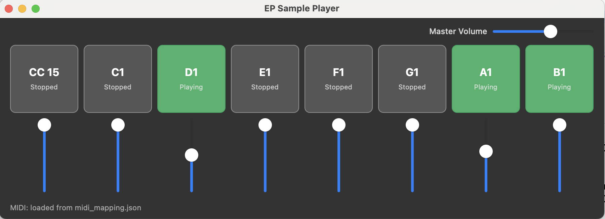

# EP Sample Player — User Instructions

## Overview

EP Sample Player is a macOS application that plays audio samples triggered by mouse clicks or MIDI input. It provides 8 pads, each mapped to a WAV file, with individual volume control and a master volume.

---

## Main Window



### Pads

The main window shows a row of **8 pads**. Each pad displays:
- A **label** — the MIDI note or CC name assigned to it (e.g. `C1`, `D1`, `CC 15`)
- A **status** — either `Playing` or `Stopped`

| Color | Meaning |
|-------|---------|
| Green | The sample is currently playing |
| Dark gray | The sample is stopped |

**To toggle a pad**, click it. Clicking a stopped pad starts playback; clicking a playing pad stops it.

Pads can also be triggered remotely via MIDI (see [MIDI Setup](#midi-setup)).

### Volume Sliders

Below each pad is a **vertical volume slider** (blue line with a white handle). Drag the handle up to increase the pad's volume, or down to reduce it.

### Master Volume

The **Master Volume** slider in the top-right corner controls the overall output level for all pads simultaneously.

### Status Bar

The bottom-left corner shows the MIDI mapping status, e.g.:

```
MIDI: loaded from midi_mapping.json
```

---

## MIDI Setup

Open the MIDI Preferences window from the application menu to manage MIDI input devices.

### MIDI Preferences Window

The window lists all available **MIDI Sources** detected on your system with two columns:

| Column | Description |
|--------|-------------|
| **Device** | Name of the MIDI input device |
| **Status** | Connect / Disconnect button |

- Click **Connect** to start receiving MIDI from a device.
- Click **Disconnect** to stop receiving MIDI from a device.
- Click **Refresh** to rescan for newly connected devices.

### MIDI Mapping

Pad-to-MIDI assignments are defined in `midi_mapping.json`. The app loads this file from two locations, in order of priority:

1. **User override** — `~/Library/Application Support/<BundleID>/midi_mapping.json`
2. **Bundle default** — the file embedded inside the application bundle

To customize the mapping, copy the bundle default to the user override location and edit it. The app will pick up the user file automatically on next launch.

If the mapping file cannot be loaded, a warning dialog is shown and MIDI triggers are disabled (pads can still be toggled by mouse click).

---

## Samples

Each pad plays a WAV file named `pad_01.wav` through `pad_08.wav`, bundled inside the application under the `Samples` folder. Replacing these files requires rebuilding the application.
